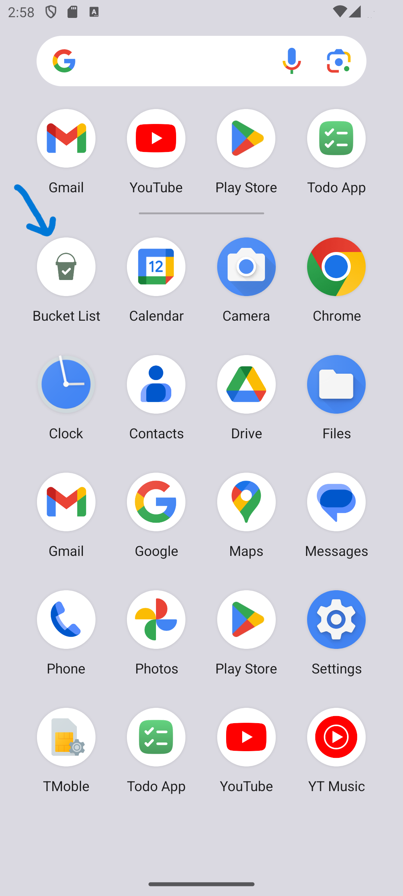
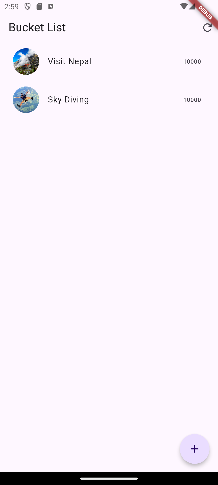
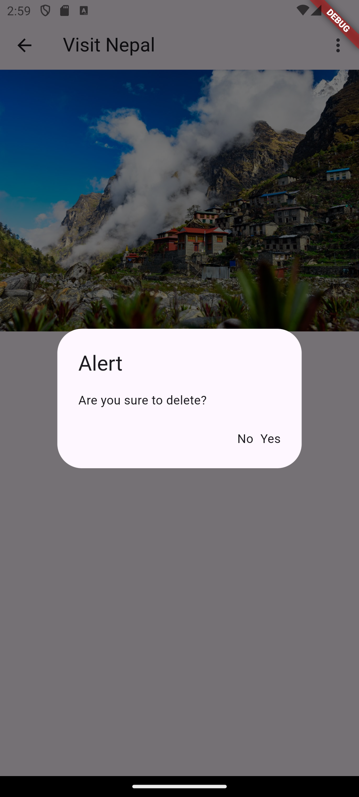
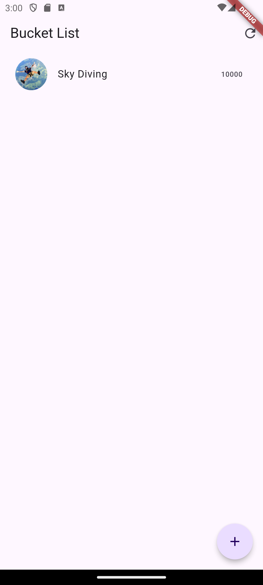
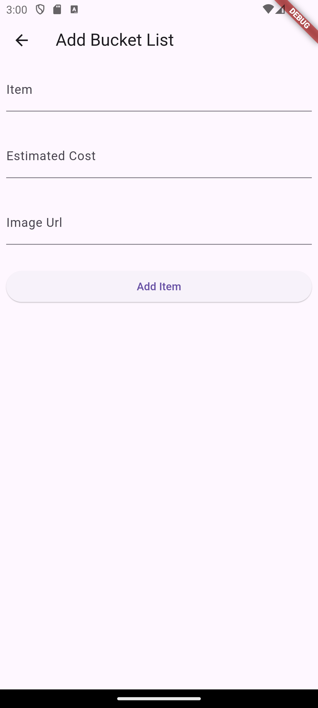
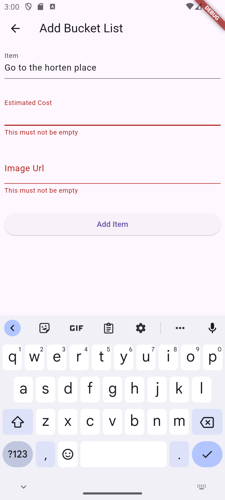
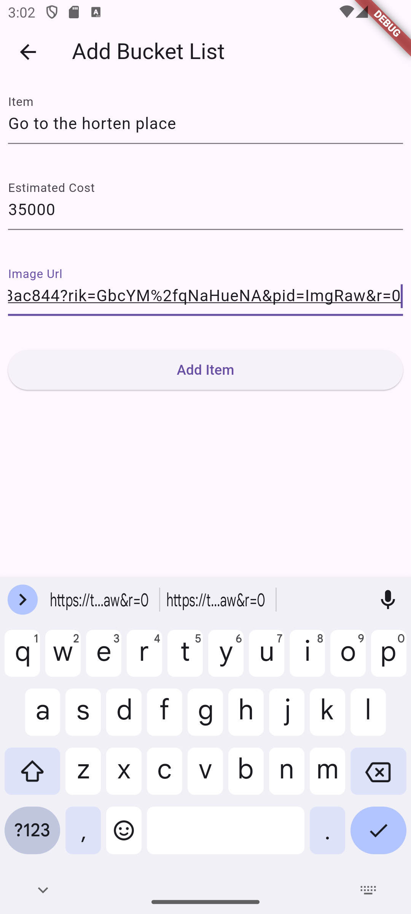
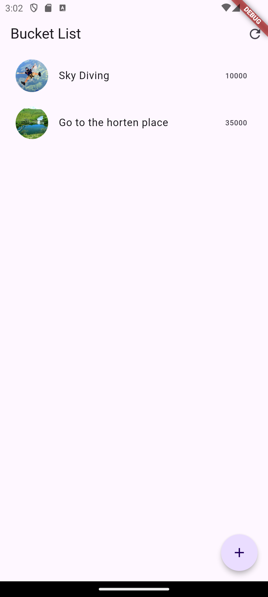
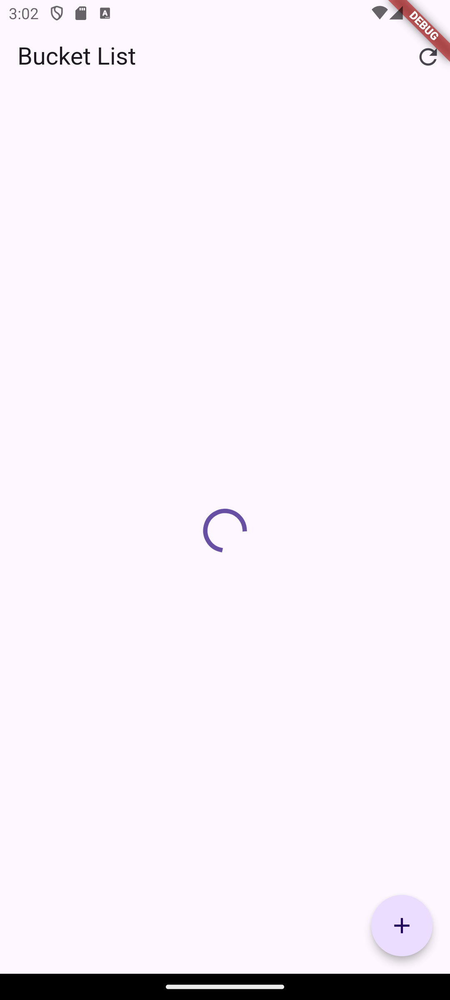
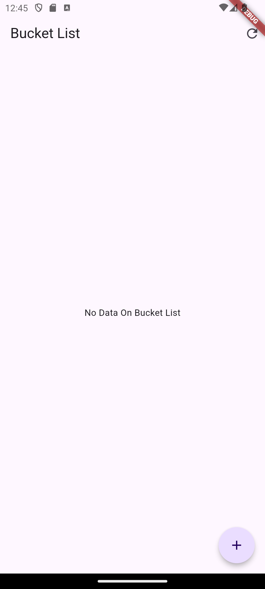

## Project Overview

This Flutter project serves as a starting point for building Flutter applications. It includes various features and functionalities that can be used as a reference or a template for your own projects.

## Tools and Technologies Used

- Flutter: Flutter is an open-source UI software development kit created by Google. It allows you to build natively compiled applications for mobile, web, and desktop from a single codebase.

- Firebase: Firebase is a mobile and web application development platform that provides various services and tools for building high-quality apps. In this project, Firebase is used for data storage and retrieval.

- Dio: Dio is a powerful HTTP client for Dart, which is used for making API requests and handling responses in this project.

## Key Features

- Form Validation: The project implements form validation using the `Form` widget and `TextFormField` to ensure that the input field is not empty. ✅

- Adding New Items: The functionality to add new bucket list items is enabled, allowing users to easily add new items to their list. ➕

- Marking Items as Done: Users can mark items as done using a PATCH request API. The project includes a `markAsDone` function and implements conditional rendering to display only incomplete items. ✅

- Handling No Changes: The project handles the scenario where the user does not make any changes to an item and goes back to the bucket list screen. It triggers a refresh of the bucket list screen. ♻️

- Deleting Items: The project activates the delete API by passing the index as a parameter to delete a specific item. ❌

- Conditional Rendering: The project implements conditional rendering to render the list as invisible if the list item is null. It also displays a "No data in bucket list" message if the item list is empty. ❌

- Image Display: After clicking on a list item, the project displays the image using the `Container` widget and `NetworkImage`. 🖼️

- Navigation: The project implements navigation between screens using `MaterialPageRoute` and named routes. 🚀

- Loading Indicator: The project uses conditional rendering to display a `CircularProgressIndicator` while loading data. ⏳

- Auto-Refreshing: The project includes a `RefresherIndicator` widget for auto-refreshing the page. ♻️

- Data Fetching: The project fetches data from Firebase using the `getData` async function and displays it in the main screen using `Column`, `Expanded`, and `ListView.builder`. 🔄

- Error Handling: The project implements error handling using a try-catch block while fetching data from the API. ❌

### See The Snap Shot In This Work

## App Icon

## App Welcome Screen

## Bucket List 

## Item View

## Item Manage

## Item Delete Alert

## Item After Deleting

## Item Adding

## Item Adding From Validation

## Input Details Correctly

## After Added Item

## When Reloading App Is On Operational Task

## When Bucket List Is Empty

## Conclusion

This project demonstrates the use of Flutter, Firebase, and Dio to build a Flutter application with various features and functionalities. It provides a solid foundation for building your own Flutter projects. Feel free to explore the code and use it as a reference for your own projects.

